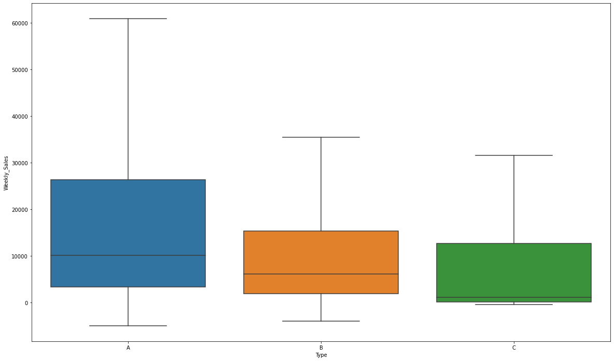
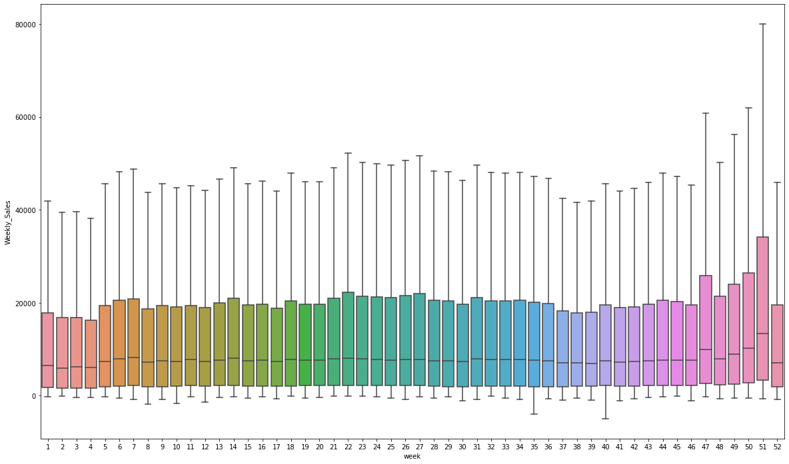

```python
# Lean Version
'''
import numpy as np
import pandas as pd

import os
for dirname, _, filenames in os.walk('/kaggle/input'):
    for filename in filenames:
        print(os.path.join(dirname, filename))

train = pd.read_csv("/kaggle/input/walmart-recruiting-store-sales-forecasting/train.csv.zip")
test = pd.read_csv("/kaggle/input/walmart-recruiting-store-sales-forecasting/test.csv.zip")
all_data = pd.concat([train, test])
all_data2 = all_data.drop(["Date","Weekly_Sales"],1)
train2 = all_data2[:len(train)]
test2 = all_data2[len(train):]

train2 = train.drop(['Date','Weekly_Sales'],1)
test2 = test.drop('Date',1)

from sklearn.ensemble import RandomForestRegressor
rf = RandomForestRegressor(n_jobs=4)
# %%time
rf.fit(train2,train['Weekly_Sales'])
result = rf.predict(test2)

sub = pd.read_csv("/kaggle/input/walmart-recruiting-store-sales-forecasting/sampleSubmission.csv.zip")
sub["Weekly_Sales"] = result
sub.to_csv("sub_0824.csv",index = 0)
'''
```

## Main Version


```python
# This Python 3 environment comes with many helpful analytics libraries installed
# It is defined by the kaggle/python Docker image: https://github.com/kaggle/docker-python
# For example, here's several helpful packages to load

import numpy as np # linear algebra
import pandas as pd # data processing, CSV file I/O (e.g. pd.read_csv)

# Input data files are available in the read-only "../input/" directory
# For example, running this (by clicking run or pressing Shift+Enter) will list all files under the input directory

import os
for dirname, _, filenames in os.walk('/kaggle/input'):
    for filename in filenames:
        print(os.path.join(dirname, filename))

# You can write up to 5GB to the current directory (/kaggle/working/) that gets preserved as output when you create a version using "Save & Run All" 
# You can also write temporary files to /kaggle/temp/, but they won't be saved outside of the current session
```

    /kaggle/input/walmart-recruiting-store-sales-forecasting/features.csv.zip
    /kaggle/input/walmart-recruiting-store-sales-forecasting/stores.csv
    /kaggle/input/walmart-recruiting-store-sales-forecasting/sampleSubmission.csv.zip
    /kaggle/input/walmart-recruiting-store-sales-forecasting/train.csv.zip
    /kaggle/input/walmart-recruiting-store-sales-forecasting/test.csv.zip


데이터가 다른 대회들보다 이질적임.
학습을 다른 대회에 비해 더 많이 해줘야함.


```python
train = pd.read_csv("/kaggle/input/walmart-recruiting-store-sales-forecasting/train.csv.zip")
test = pd.read_csv("/kaggle/input/walmart-recruiting-store-sales-forecasting/test.csv.zip")
```


```python
# display(train, test)

all_data = pd.concat([train, test])
```


```python
store = pd.read_csv("/kaggle/input/walmart-recruiting-store-sales-forecasting/stores.csv")

# store #타입이 A면 size가 좀 크구나~ B면 좀 작고 C면 좀더 작고

all_data = pd.merge(all_data, store, on = "Store", how = "left") #merge는 딱 한번만 실행해야함. 또하면 또만들어짐
```


```python
# 새로 추가된 칼럼("Type")이 쓸모있는지 그래프로 확인
import matplotlib.pyplot as plt
import seaborn as sns

plt.figure(figsize = (20,12)) #figsize 가로세로 길이
sns.boxplot(all_data["Type"],all_data["Weekly_Sales"],showfliers=False)
```


    <matplotlib.axes._subplots.AxesSubplot at 0x7f988d054ed0>





```python
# 라벨인코딩
all_data = all_data.replace({"A": 1, "B": 2, "C": 3}) # Type의 ABC가 문자열로 돼있어서 숫자로 바꿈
```


```python
all_data["Date"] = all_data["Date"].astype("datetime64")
all_data["year"] = all_data["Date"].dt.year # 성능 개선!  4518.57
all_data["month"] = all_data["Date"].dt.month # 엄청난 성능 개선!  2982.31
all_data["week"] = all_data["Date"].dt.week

# all_data["weekday"] = all_data["Date"].dt.weekday # 별 효과 없음 2983.86 #정답이 일주일단위로 결산해서 나온 판매량이기 때문에 요일이 의미가 없음

#month가 성능개선 엄청 많이 해주는 이유: 
#This competition is evaluated on the weighted mean absolute error (WMAE):
#wi are weights. w = 5 if the week is a holiday week, 1 otherwise
#공휴일을 잘맞출수록 점수를 가중해서 많이 주게 되어있음
#>특정 월 안에 들어가있는 공휴일을 더 고려해서 학습할 수 있게 됨
```

    /opt/conda/lib/python3.7/site-packages/ipykernel_launcher.py:4: FutureWarning: Series.dt.weekofyear and Series.dt.week have been deprecated.  Please use Series.dt.isocalendar().week instead.
      after removing the cwd from sys.path.


```python
# plt.figure(figsize = (20,12)) #figsize 가로세로 길이
# sns.boxplot(all_data["week"],all_data["Weekly_Sales"]) #outlier가 너무 커서 그래프가 좀 해석하기 어렵게 나옴

plt.figure(figsize = (20,12)) #figsize 가로세로 길이
sns.boxplot(all_data["week"],all_data["Weekly_Sales"],showfliers=False) #이상치를 제거해서 눈으로 보는 방법
#week가 도움되는 이유는 특정 달 안의 공휴일들을 나눠서 더 집중적으로 학습할 수 있음
```


    <matplotlib.axes._subplots.AxesSubplot at 0x7f988ceb6290>





```python
all_data2 = all_data.drop(["Date","Weekly_Sales"],1)
```


```python
train2 = all_data2[:len(train)]
test2 = all_data2[len(train):]
```


```python
# from sklearn.ensemble import RandomForestRegressor
# rf = RandomForestRegressor(n_jobs=4) #n_jobs=4 : cpu 4개 써라
# # %%time
# rf.fit(train2,train['Weekly_Sales'])
# result = rf.predict(test2)
```


```python
from lightgbm import LGBMRegressor
lgb = LGBMRegressor(n_estimators) #num_leaves
lgb.fit(train2,train['Weekly_Sales'])
result = lgb.predict(test2)
```


```python
# 결과 정리&제출
sub = pd.read_csv("/kaggle/input/walmart-recruiting-store-sales-forecasting/sampleSubmission.csv.zip")
sub["Weekly_Sales"] = result
sub.to_csv("sub_0824r.csv",index = 0) #index기본값은 1, 이게 기본값1로 돼있으면 옆에 index컬럼 생김
```


```python
# 이것도 로그함수 씌워보자(결과 좋아질 것임)
```
