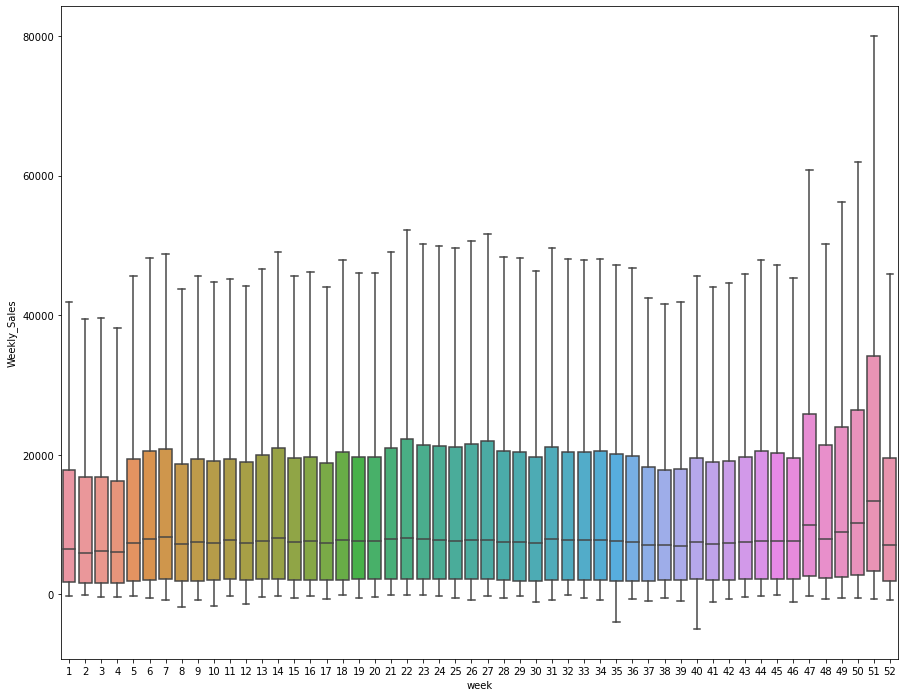

```python
# This Python 3 environment comes with many helpful analytics libraries installed
# It is defined by the kaggle/python Docker image: https://github.com/kaggle/docker-python
# For example, here's several helpful packages to load

import numpy as np # linear algebra
import pandas as pd # data processing, CSV file I/O (e.g. pd.read_csv)

# Input data files are available in the read-only "../input/" directory
# For example, running this (by clicking run or pressing Shift+Enter) will list all files under the input directory

import os
for dirname, _, filenames in os.walk('/kaggle/input'):
    for filename in filenames:
        print(os.path.join(dirname, filename))

# You can write up to 20GB to the current directory (/kaggle/working/) that gets preserved as output when you create a version using "Save & Run All" 
# You can also write temporary files to /kaggle/temp/, but they won't be saved outside of the current session
```

    /kaggle/input/walmart-recruiting-store-sales-forecasting/train.csv.zip
    /kaggle/input/walmart-recruiting-store-sales-forecasting/sampleSubmission.csv.zip
    /kaggle/input/walmart-recruiting-store-sales-forecasting/stores.csv
    /kaggle/input/walmart-recruiting-store-sales-forecasting/features.csv.zip
    /kaggle/input/walmart-recruiting-store-sales-forecasting/test.csv.zip


```python
# os모듈. 파이썬 기본내장 라이브러리.
# Operating System의 약자로서 운영체제에서 제공되는 여러 기능을 파이썬에서 수행할 수 있게 해줍
# os.walk() 모든 디렉토리/파일 출력
```


```python
train = pd.read_csv("/kaggle/input/walmart-recruiting-store-sales-forecasting/train.csv.zip")
```


```python
# train
```


```python
test = pd.read_csv("/kaggle/input/walmart-recruiting-store-sales-forecasting/test.csv.zip")
```


```python
# test
```


```python
display(train,test)
```


<div>
<style scoped>
    .dataframe tbody tr th:only-of-type {
        vertical-align: middle;
    }

    .dataframe tbody tr th {
        vertical-align: top;
    }

    .dataframe thead th {
        text-align: right;
    }
</style>
<table border="1" class="dataframe">
  <thead>
    <tr style="text-align: right;">
      <th></th>
      <th>Store</th>
      <th>Dept</th>
      <th>Date</th>
      <th>Weekly_Sales</th>
      <th>IsHoliday</th>
    </tr>
  </thead>
  <tbody>
    <tr>
      <th>0</th>
      <td>1</td>
      <td>1</td>
      <td>2010-02-05</td>
      <td>24924.50</td>
      <td>False</td>
    </tr>
    <tr>
      <th>1</th>
      <td>1</td>
      <td>1</td>
      <td>2010-02-12</td>
      <td>46039.49</td>
      <td>True</td>
    </tr>
    <tr>
      <th>2</th>
      <td>1</td>
      <td>1</td>
      <td>2010-02-19</td>
      <td>41595.55</td>
      <td>False</td>
    </tr>
    <tr>
      <th>3</th>
      <td>1</td>
      <td>1</td>
      <td>2010-02-26</td>
      <td>19403.54</td>
      <td>False</td>
    </tr>
    <tr>
      <th>4</th>
      <td>1</td>
      <td>1</td>
      <td>2010-03-05</td>
      <td>21827.90</td>
      <td>False</td>
    </tr>
    <tr>
      <th>...</th>
      <td>...</td>
      <td>...</td>
      <td>...</td>
      <td>...</td>
      <td>...</td>
    </tr>
    <tr>
      <th>421565</th>
      <td>45</td>
      <td>98</td>
      <td>2012-09-28</td>
      <td>508.37</td>
      <td>False</td>
    </tr>
    <tr>
      <th>421566</th>
      <td>45</td>
      <td>98</td>
      <td>2012-10-05</td>
      <td>628.10</td>
      <td>False</td>
    </tr>
    <tr>
      <th>421567</th>
      <td>45</td>
      <td>98</td>
      <td>2012-10-12</td>
      <td>1061.02</td>
      <td>False</td>
    </tr>
    <tr>
      <th>421568</th>
      <td>45</td>
      <td>98</td>
      <td>2012-10-19</td>
      <td>760.01</td>
      <td>False</td>
    </tr>
    <tr>
      <th>421569</th>
      <td>45</td>
      <td>98</td>
      <td>2012-10-26</td>
      <td>1076.80</td>
      <td>False</td>
    </tr>
  </tbody>
</table>
<p>421570 rows × 5 columns</p>
</div>


<div>
<style scoped>
    .dataframe tbody tr th:only-of-type {
        vertical-align: middle;
    }

    .dataframe tbody tr th {
        vertical-align: top;
    }

    .dataframe thead th {
        text-align: right;
    }
</style>
<table border="1" class="dataframe">
  <thead>
    <tr style="text-align: right;">
      <th></th>
      <th>Store</th>
      <th>Dept</th>
      <th>Date</th>
      <th>IsHoliday</th>
    </tr>
  </thead>
  <tbody>
    <tr>
      <th>0</th>
      <td>1</td>
      <td>1</td>
      <td>2012-11-02</td>
      <td>False</td>
    </tr>
    <tr>
      <th>1</th>
      <td>1</td>
      <td>1</td>
      <td>2012-11-09</td>
      <td>False</td>
    </tr>
    <tr>
      <th>2</th>
      <td>1</td>
      <td>1</td>
      <td>2012-11-16</td>
      <td>False</td>
    </tr>
    <tr>
      <th>3</th>
      <td>1</td>
      <td>1</td>
      <td>2012-11-23</td>
      <td>True</td>
    </tr>
    <tr>
      <th>4</th>
      <td>1</td>
      <td>1</td>
      <td>2012-11-30</td>
      <td>False</td>
    </tr>
    <tr>
      <th>...</th>
      <td>...</td>
      <td>...</td>
      <td>...</td>
      <td>...</td>
    </tr>
    <tr>
      <th>115059</th>
      <td>45</td>
      <td>98</td>
      <td>2013-06-28</td>
      <td>False</td>
    </tr>
    <tr>
      <th>115060</th>
      <td>45</td>
      <td>98</td>
      <td>2013-07-05</td>
      <td>False</td>
    </tr>
    <tr>
      <th>115061</th>
      <td>45</td>
      <td>98</td>
      <td>2013-07-12</td>
      <td>False</td>
    </tr>
    <tr>
      <th>115062</th>
      <td>45</td>
      <td>98</td>
      <td>2013-07-19</td>
      <td>False</td>
    </tr>
    <tr>
      <th>115063</th>
      <td>45</td>
      <td>98</td>
      <td>2013-07-26</td>
      <td>False</td>
    </tr>
  </tbody>
</table>
<p>115064 rows × 4 columns</p>
</div>


```python
train.info()
```

    <class 'pandas.core.frame.DataFrame'>
    RangeIndex: 421570 entries, 0 to 421569
    Data columns (total 5 columns):
     #   Column        Non-Null Count   Dtype  
    ---  ------        --------------   -----  
     0   Store         421570 non-null  int64  
     1   Dept          421570 non-null  int64  
     2   Date          421570 non-null  object 
     3   Weekly_Sales  421570 non-null  float64
     4   IsHoliday     421570 non-null  bool   
    dtypes: bool(1), float64(1), int64(2), object(1)
    memory usage: 13.3+ MB


```python
# '파이썬 dtpye 종류' 검색.
# https://rfriend.tistory.com/285#:~:text=%EB%8D%B0%EC%9D%B4%ED%84%B0%20%ED%98%95%ED%83%9C(Data%20Type%2C%20dtype,%EB%B6%80%ED%98%B8%20%EC%97%86%EB%8A%94%20%EC%A0%95%EC%88%98%ED%98%95%20(unsigned%20integers%20%2C
# 'pandas dtype string vs object' 검색
# https://pbpython.com/pandas_dtypes.html
```


```python
# train.drop(["Date","Weekly_Sales"]) #에러남. axis가 0이면 데이터프레임의 칼럼명을 없애서 이걸 칼럼명 인덱싱을 못함.
```


```python
train2 = train.drop(["Date","Weekly_Sales"],1) #axis, default는 0
test2 = test.drop("Date",1)
```


```python
train3 = train.drop(["Weekly_Sales"],1) # ValueError: could not convert string to float: '2010-02-05'
```


```python
from sklearn.ensemble import RandomForestRegressor
rf = RandomForestRegressor(n_jobs=4) # 탭 활용
```


```python
%%time
rf.fit(train2,train["Weekly_Sales"]) # 탭 활용
```

    CPU times: user 42.1 s, sys: 210 ms, total: 42.3 s
    Wall time: 11.3 s


    RandomForestRegressor(n_jobs=4)


```python
result = rf.predict(test2)
```


```python
# 제출 파일 만들기
sub = pd.read_csv("/kaggle/input/walmart-recruiting-store-sales-forecasting/sampleSubmission.csv.zip")
# sub
```


```python
sub["Weekly_Sales"] = result
# sub
```


```python
sub.to_csv("submission1.csv",index=0) #default=True : Write row names (index).
```


```python
# public 점수 vs private 점수
# Public Leaderboard - test data의 일부로 매겨지는 랭킹.
# Private Leaderboard - 최종 랭킹은 Public Leaderboard에 사용되지 않은 test data를 기반으로 매겨짐.
# The test set given to us is actually pre-divided into PartA and PartB. In our submissions,
# Kaggle can determine PartA from PartB and use PartA to generate the accuracy of our model(displayed on the public LB), 
# PartB to test the overfitting problems(displayed on the private LB).
```


```python
train = pd.read_csv("/kaggle/input/walmart-recruiting-store-sales-forecasting/train.csv.zip")
test = pd.read_csv("/kaggle/input/walmart-recruiting-store-sales-forecasting/test.csv.zip")

all_data = pd.concat([train,test])
```


```python
all_data
```


<div>
<style scoped>
    .dataframe tbody tr th:only-of-type {
        vertical-align: middle;
    }

    .dataframe tbody tr th {
        vertical-align: top;
    }

    .dataframe thead th {
        text-align: right;
    }
</style>
<table border="1" class="dataframe">
  <thead>
    <tr style="text-align: right;">
      <th></th>
      <th>Store</th>
      <th>Dept</th>
      <th>Date</th>
      <th>Weekly_Sales</th>
      <th>IsHoliday</th>
    </tr>
  </thead>
  <tbody>
    <tr>
      <th>0</th>
      <td>1</td>
      <td>1</td>
      <td>2010-02-05</td>
      <td>24924.50</td>
      <td>False</td>
    </tr>
    <tr>
      <th>1</th>
      <td>1</td>
      <td>1</td>
      <td>2010-02-12</td>
      <td>46039.49</td>
      <td>True</td>
    </tr>
    <tr>
      <th>2</th>
      <td>1</td>
      <td>1</td>
      <td>2010-02-19</td>
      <td>41595.55</td>
      <td>False</td>
    </tr>
    <tr>
      <th>3</th>
      <td>1</td>
      <td>1</td>
      <td>2010-02-26</td>
      <td>19403.54</td>
      <td>False</td>
    </tr>
    <tr>
      <th>4</th>
      <td>1</td>
      <td>1</td>
      <td>2010-03-05</td>
      <td>21827.90</td>
      <td>False</td>
    </tr>
    <tr>
      <th>...</th>
      <td>...</td>
      <td>...</td>
      <td>...</td>
      <td>...</td>
      <td>...</td>
    </tr>
    <tr>
      <th>115059</th>
      <td>45</td>
      <td>98</td>
      <td>2013-06-28</td>
      <td>NaN</td>
      <td>False</td>
    </tr>
    <tr>
      <th>115060</th>
      <td>45</td>
      <td>98</td>
      <td>2013-07-05</td>
      <td>NaN</td>
      <td>False</td>
    </tr>
    <tr>
      <th>115061</th>
      <td>45</td>
      <td>98</td>
      <td>2013-07-12</td>
      <td>NaN</td>
      <td>False</td>
    </tr>
    <tr>
      <th>115062</th>
      <td>45</td>
      <td>98</td>
      <td>2013-07-19</td>
      <td>NaN</td>
      <td>False</td>
    </tr>
    <tr>
      <th>115063</th>
      <td>45</td>
      <td>98</td>
      <td>2013-07-26</td>
      <td>NaN</td>
      <td>False</td>
    </tr>
  </tbody>
</table>
<p>536634 rows × 5 columns</p>
</div>


```python
all_data["Date"] = all_data["Date"].astype("datetime64")
```


```python
all_data.info()
```

    <class 'pandas.core.frame.DataFrame'>
    Int64Index: 536634 entries, 0 to 115063
    Data columns (total 5 columns):
     #   Column        Non-Null Count   Dtype         
    ---  ------        --------------   -----         
     0   Store         536634 non-null  int64         
     1   Dept          536634 non-null  int64         
     2   Date          536634 non-null  datetime64[ns]
     3   Weekly_Sales  421570 non-null  float64       
     4   IsHoliday     536634 non-null  bool          
    dtypes: bool(1), datetime64[ns](1), float64(1), int64(2)
    memory usage: 21.0 MB


```python
all_data["year"] = all_data["Date"].dt.year
all_data["month"] = all_data["Date"].dt.month
all_data["week"] = all_data["Date"].dt.week
# day, weekday, hour,minute,second
```

    /opt/conda/lib/python3.7/site-packages/ipykernel_launcher.py:3: FutureWarning: Series.dt.weekofyear and Series.dt.week have been deprecated.  Please use Series.dt.isocalendar().week instead.
      This is separate from the ipykernel package so we can avoid doing imports until


```python
import matplotlib.pyplot as plt
import seaborn as sns

plt.figure(figsize = (15,12)) #figsize 가로세로 길이
sns.boxplot(all_data["week"],all_data["Weekly_Sales"],showfliers=False)

```


    <matplotlib.axes._subplots.AxesSubplot at 0x7f72e95f0cd0>





```python
# all_data
```


```python
all_data2 = all_data.drop(["Date","Weekly_Sales"],1)
```


```python
train2 = all_data2[:len(train)]
test2 = all_data2[len(train):]
```


```python
from sklearn.ensemble import RandomForestRegressor
rf = RandomForestRegressor(n_jobs=4)
```


```python
%%time
rf.fit(train2,train["Weekly_Sales"])
```

    CPU times: user 2min 52s, sys: 3.36 s, total: 2min 55s
    Wall time: 46 s


    RandomForestRegressor(n_jobs=4)


```python
result = rf.predict(test2)
```


```python
# 제출 파일 만들기
sub = pd.read_csv("/kaggle/input/walmart-recruiting-store-sales-forecasting/sampleSubmission.csv.zip")
sub["Weekly_Sales"] = result
sub.to_csv("submission2.csv",index=0) 
```


```python
sub
```


<div>
<style scoped>
    .dataframe tbody tr th:only-of-type {
        vertical-align: middle;
    }

    .dataframe tbody tr th {
        vertical-align: top;
    }

    .dataframe thead th {
        text-align: right;
    }
</style>
<table border="1" class="dataframe">
  <thead>
    <tr style="text-align: right;">
      <th></th>
      <th>Id</th>
      <th>Weekly_Sales</th>
    </tr>
  </thead>
  <tbody>
    <tr>
      <th>0</th>
      <td>1_1_2012-11-02</td>
      <td>33855.9415</td>
    </tr>
    <tr>
      <th>1</th>
      <td>1_1_2012-11-09</td>
      <td>18917.1512</td>
    </tr>
    <tr>
      <th>2</th>
      <td>1_1_2012-11-16</td>
      <td>19152.0852</td>
    </tr>
    <tr>
      <th>3</th>
      <td>1_1_2012-11-23</td>
      <td>20191.1082</td>
    </tr>
    <tr>
      <th>4</th>
      <td>1_1_2012-11-30</td>
      <td>22630.5954</td>
    </tr>
    <tr>
      <th>...</th>
      <td>...</td>
      <td>...</td>
    </tr>
    <tr>
      <th>115059</th>
      <td>45_98_2013-06-28</td>
      <td>689.8845</td>
    </tr>
    <tr>
      <th>115060</th>
      <td>45_98_2013-07-05</td>
      <td>679.5177</td>
    </tr>
    <tr>
      <th>115061</th>
      <td>45_98_2013-07-12</td>
      <td>698.0683</td>
    </tr>
    <tr>
      <th>115062</th>
      <td>45_98_2013-07-19</td>
      <td>776.5807</td>
    </tr>
    <tr>
      <th>115063</th>
      <td>45_98_2013-07-26</td>
      <td>686.8732</td>
    </tr>
  </tbody>
</table>
<p>115064 rows × 2 columns</p>
</div>


```python
1+2
```


    3


```python
print("pypypython")
```

    pypypython


```python

```
